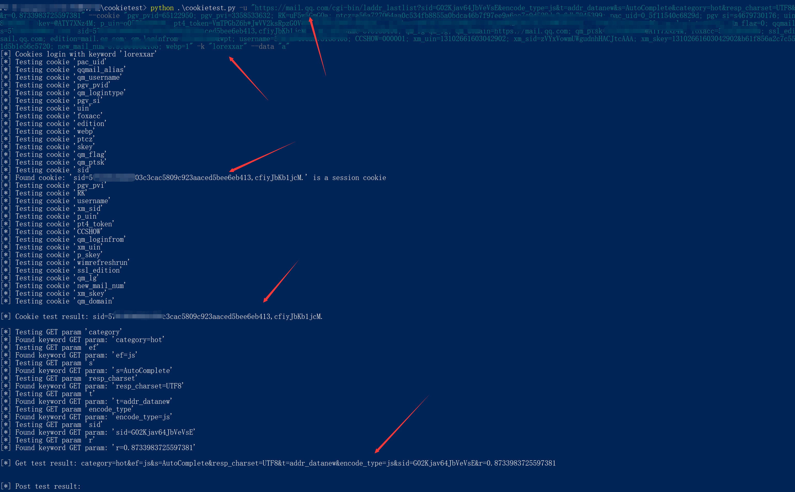

# Minitools - CookieTest

ps: Please run the script in python2.7 environment.


用于快速测试api或某个请求的必选参数、cookie的脚本.


```
> python .\cookietest.py
Usage: cookietest.py [options]

Options:
  --version             show program's version number and exit
  -h, --help            show this help message and exit
  -u URL, --url=URL     Target URL (e.g.
                        "http://www.target.com/page.php?id=1")
  --data=DATA           POST data (e.g. "query=test")
  --cookie=COOKIE       HTTP Cookie header value
  --user-agent=UA       HTTP User-Agent header value
  --referer=REFERER     HTTP Referer header value
  -k KEYWORD, --keyword=KEYWORD
                        Cookie login success keyword
```


